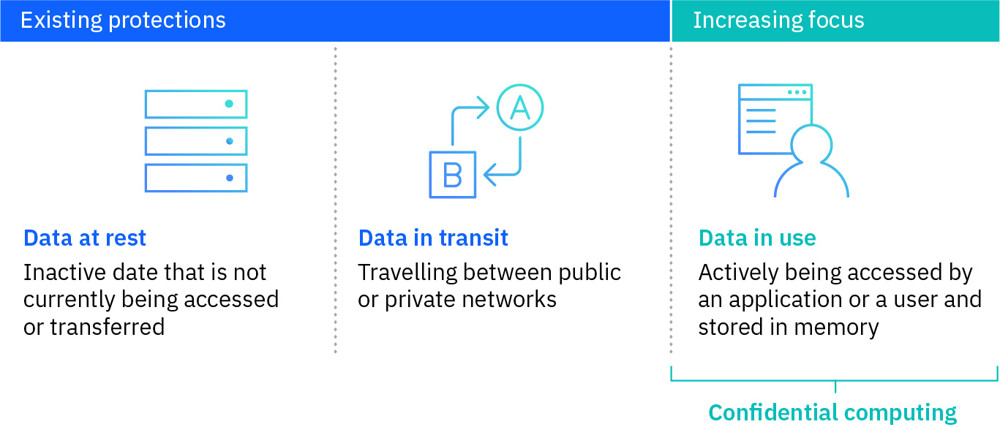
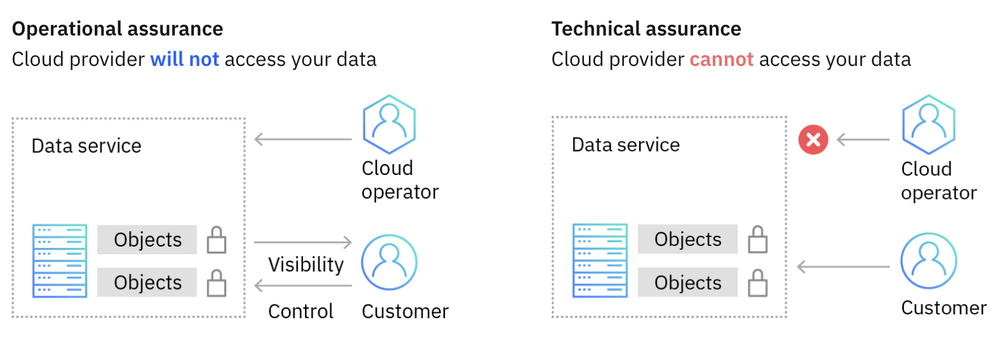

---

copyright:
  years: 2023, 2023
lastupdated: "2023-11-24"

keywords: confidential computing, what is confidential computing, IBM confidential computing, IBM Cloud confidential computing

subcollection: confidential-computing

---

{{site.data.keyword.attribute-definition-list}}

# Getting started with Confidential Computing
{: #about}

Confidential computing (CC) protects applications and data while in use by keeping them encrypted all the time, even in memory, and only decrypting inside the processor, which is also known as Trusted Execution Environment (TEE). The decryption keys are known only to the application/data owner and the processor. This way, even a compromised operating system or hypervisor can’t peek into the application or steal any sensitive data. Confidential computing is critical for cloud deployments, but also for edge deployments where such devices can be easily compromised or stolen. It’s also important for AI data processing where data needs to be shared (such as federated learning) but the data owners don’t trust the infrastructure where data needs to be jointly processed.
{: shortdesc}

{: caption="Figure 1. What is confidential computing" caption-side="bottom"}

As defined by the [Confidential Computing Consortium](https://confidentialcomputing.io/wp-content/uploads/sites/85/2021/03/confidentialcomputing_outreach_whitepaper-8-5x11-1.pdf), Confidential Computing has the following key characteristics: 

* **Data confidentiality**: Unauthorized entities cannot view data while it is in use within the TEE.
* **Data integrity**: Unauthorized entities cannot add, remove, or alter data while it is in use within the TEE.
* **Code integrity**: Unauthorized entities cannot add, remove, or alter code executing in the TEE.

## IBM confidential computing strategy
{: #cc-ibm}

IBM confidential computing strategy focuses on providing secure and trusted computing environments that protect sensitive data and workloads throughout their lifecycle. It aims to address concerns related to data privacy, security, and compliance in cloud, hybrid cloud, and edge computing environments with technical assurance rather than operation assurance.

{: caption="Figure 2. Technical assurance vs. Operational assurance" caption-side="bottom"}

IBM's confidential computing strategy encompasses the following key elements:

- **Hardware-Based Security**

  IBM leverages hardware and firmware security features to establish trusted execution environments (TEEs). These TEEs create isolated enclaves where sensitive data and computations can be securely processed, ensuring confidentiality and integrity.

- **Secure Enclaves and Isolation**

  IBM employs secure enclaves to isolate sensitive workloads, applications, and data from the underlying infrastructure and other untrusted components. This isolation prevents unauthorized access and tampering, even by privileged users or compromised systems.

- **Data Encryption and Protection**

  IBM incorporates strong encryption mechanisms to safeguard data in transit and at rest. It includes solutions such as Hyper Protect platforms, which provide encryption and key management capabilities to protect data in cloud environments.

- **Confidential Containers**

  IBM offers technologies such as Hyper Protect Container Runtime to enable the secure execution of containerized applications. By leveraging hardware-based security features, confidential containers protect sensitive workloads and data within containers, even in shared or untrusted environments.

- **Trusted Execution and Attestation**

  IBM incorporates mechanisms for attestation and verification of trusted execution environments. This ensures the integrity of the enclave and verifies that it hasn't been compromised, establishing trust between different components in the system.

- **Compliance and Standards**

  IBM's confidential computing strategy takes into account various regulatory and compliance requirements. IBM aims to provide solutions that help organizations meet industry-specific regulations and standards while maintaining data privacy and security.

- **Cloud-Based Confidential Computing**

  IBM provides confidential computing capabilities in its [Hyper Protect services](/docs/confidential-computing?topic=confidential-computing-hyper-protect-overview). These services enable organizations to leverage secure enclaves and confidential computing technologies in the cloud, providing a secure and compliant platform for sensitive workloads.

In a nut shell, IBM confidential computing strategy emphasizes the use of hardware-based security, secure enclaves, encryption, and isolation mechanisms to protect sensitive data and workloads with zero trust and technical assurance. By incorporating these elements into their offerings, IBM aims to provide organizations with secure and trusted environments that safeguard their data and maintain compliance in various computing scenarios.
