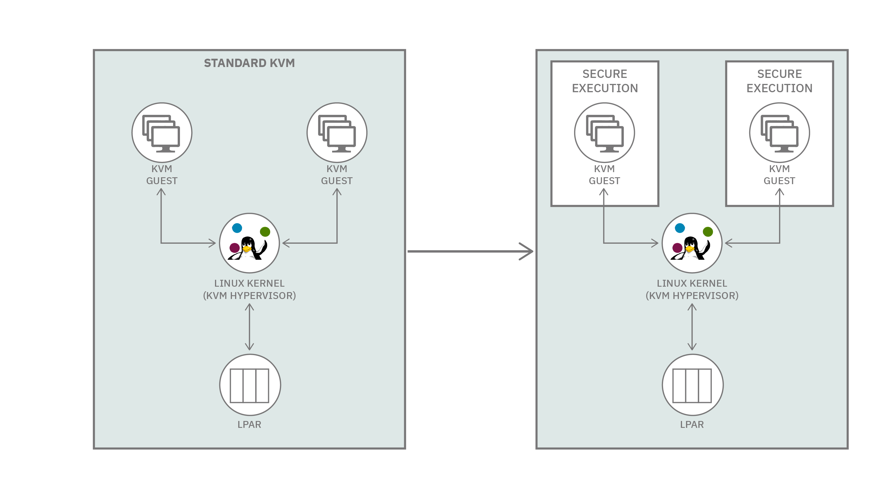

---

copyright:
  years: 2023, 2023
lastupdated: "2023-06-07"

keywords: 

subcollection: confidential-computing

---

{{site.data.keyword.attribute-definition-list}}

# Getting started with Confidential Computing
{: #about}

Confidential computing (CC) protects applications and data while in use by keeping them encrypted all the time, even in memory, and only decrypting inside the processor, which is also known as Truested Execution Environment (TEE). The decryption keys are known only to the application/data owner and the processor. This way, even a compromised operating system or hypervisor can’t peek into the application or steal any sensitive data. Confidential computing is critical for cloud deployments, but also for edge deployments where such devices can be easily compromised or stolen. It’s also important for AI data processing where data needs to be shared (such as federated learning) but the data owners don’t trust the infrastructure where data needs to be jointly processed.

 IBM Cloud® goes beyond confidential computing by protecting data across the entire compute lifecycle. You gain a higher level of privacy assurance with complete authority over your data at rest, in transit and in use. Based confidenital computing on [IBM Secure Execution for Linux technololgy](https://www.ibm.com/docs/en/linux-on-systems?topic=virtualization-introducing-secure-execution-linux){: external}, you can securely deploy workloads with better protection and isolation than a standard software environment, from both internal and external threats. This technology ensures the integrity and confidentiality of boot images, DevOps pipeline, and server authenticity. The Secure Execution for Linux is available as part of the following hardwares:
   * IBM z15 and z16
   * IBM LinuxONE III and LinuxONE 4

{: caption="Figure 1. Secure Execution for Linux" caption-side="bottom"}

At its core, a Secure Execution provides a KVM-based virtual machine, also known as Hyper Protect Container Runtime, that is fully isolated and protected from the hypervisor with encryption keys that only the IBM s390x architecture-based hardware and firmware have access to.

In practice, an encrypted Linux image is created using the host public key and a customer-specific key. Since the encryption keys are stored on the IBM s390x architecture-based hardware and firmware, the encrypted image can only be executed in a virtual machine on the host(s) it has been prepared for, and the image can't be decrypted or tampered with outside of the designated host(s). In addition, your unencrypted virtual machine memory cannot be accessed by the host operating system either.

Applications are then run inside of that virtual machine, allowing the owner of the application to focus on just disk and network data encryption, both of which can be easily handled in userland.

 

