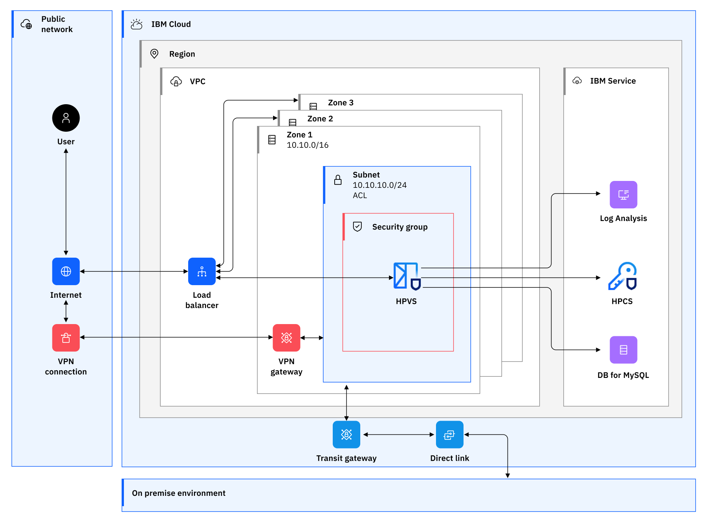

---

copyright:
  years: 2023, 2023
lastupdated: "2023-12-13"

keywords: 

subcollection: confidential-computing

---

{{site.data.keyword.attribute-definition-list}}

# Reference architecture overview on public Cloud
{: #public-cloud}

The reference architecture overview provides the supported architectures that can be used as a basis for implementing confidential computing solutions on IBM Cloud.

{: caption="Figure 1. Hyper Protect on IBM Cloud" caption-side="bottom"}

