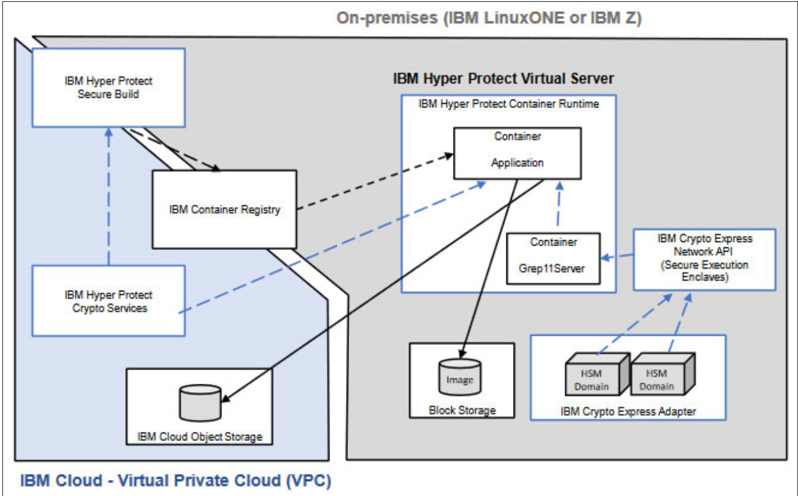

---

copyright:
  years: 2023
lastupdated: "2023-12-14"

keywords: hybrid, confidential computing solution, architecture

subcollection: confidential-computing

---

{{site.data.keyword.attribute-definition-list}}

# Architecture in Hybrid cloud 
{: #hybrid-cloud}

The reference architecture overview provides the supported architectures that can be used as a basis for implementing confidential computing solutions on Hybrid Cloud. Learn about these reference architectures in the following table.

{: caption="Figure 1. Hyper Protect on Hybrid Cloud" caption-side="bottom"}

