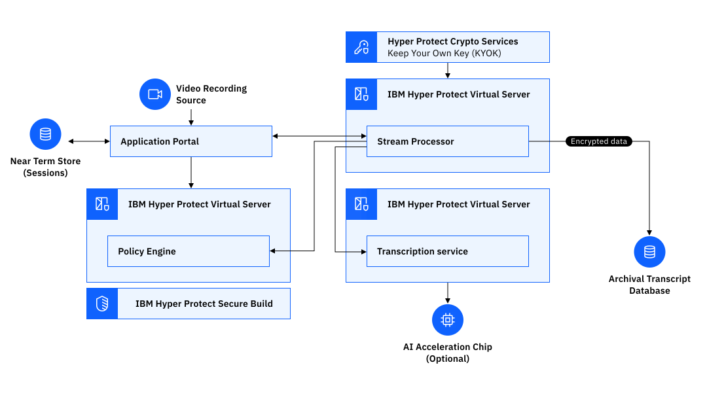

---

copyright:
  years: 2023, 2024
lastupdated: "2024-02-26"

keywords: ai, generative ai, ai model, confidential ai

subcollection: confidential-computing

---

{{site.data.keyword.attribute-definition-list}}

# Confidential AI
{: #conf-ai}

As customization of foundation models becomes more common, being done with and on LinuxONE, confidential computing on IBM Cloud ensures that any data stage and insights are protected during creation, customization, and inference outside their direct control or at third parties.
{: shortdesc}

## Challenges
{: #conf-ai-challenge}

Data that is used for training and testing AI and ML models can be valuable, sensitive, and regulated. For example, in the healthcare industry, AI can be leveraged to help disease diagnostic and drug development. The sensitive patient health information and diagnostic history data are shared for ML model training. How to ensure data privacy while benefiting from data sharing?

## How can the Confidential Services Platform help?
{: #conf-ai-hp}

The Confidential Services Platform can protect AI processes, like training, test, and inference by using features like memory protection, code and, data confidentiality and integrity, disk encryption, attestation, and the contract mechanism with separation of duty.

The following diagram illustrates an example of a complete end-to-end flow for securely transcribing from a recording source and processing transcription, all within a confidential computing environment with boundaries of protection around all the important components.

{: caption="Figure 1. AI use case example" caption-side="bottom"}

In this example, with Hyper Protect Services, you benefit from the following aspects:

- Each individual component is built and protected by utilizing the IBM Hyper Protect Secure Build server to ensure no image tampering.
- Data is stored being encrypted with technical-assured encryption keys.
- AI models can also be executed within the save boundary of a Trusted Execution Environment that uses the built-in acceleration of IBM Telum processor for AI with the IBM LinuxONE and IBM Z platforms.
