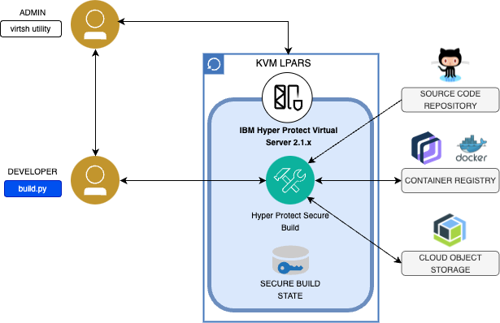

---

copyright:
  years: 2023, 2023
lastupdated: "2023-08-03"

keywords: 

subcollection: confidential-computing

---

{{site.data.keyword.attribute-definition-list}}

# Secure workload supply chain
{: #devsecops}

How to leverage confidential computing to secure the development and build pipeline.

Whether you are building a cloud native application, or on an application modernization journey, you can now do both with peace of mind by leveraging IBM’s Secure Execution technology.  Containerizing applications within a Confidential Computing environment ensures that your applications are protected, even the IBM admin doesn’t have access, and workloads are isolated by a secure boundary to prevent privilege user escalation. 

{: caption="Figure 1. Secure Build with Hyper Protect" caption-side="bottom"}

## On cloud
{: #on-cloud}

{: caption="Figure 1. Secure Build on IBM Cloud" caption-side="bottom"}

## On-prem
{: #on-prem}

{: caption="Figure 1. Secure Build for on-premises" caption-side="bottom"}