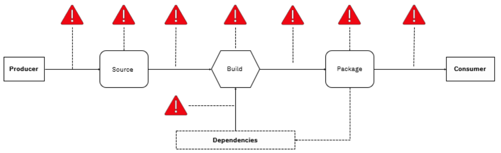
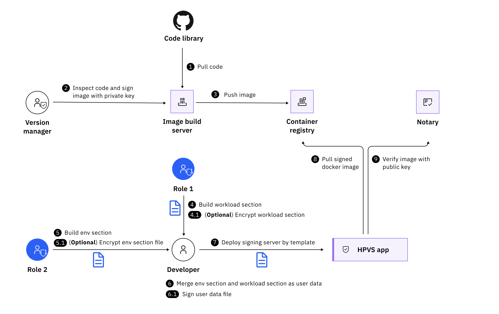
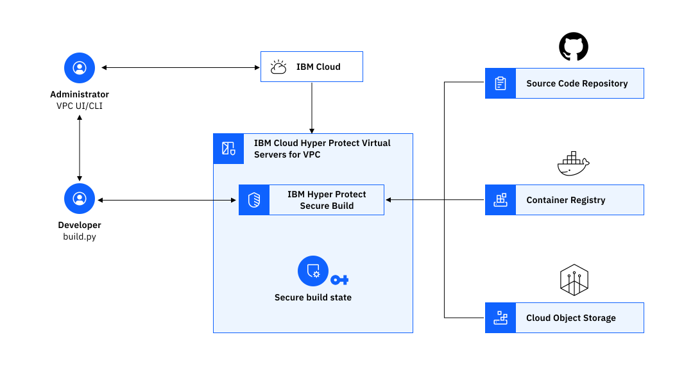
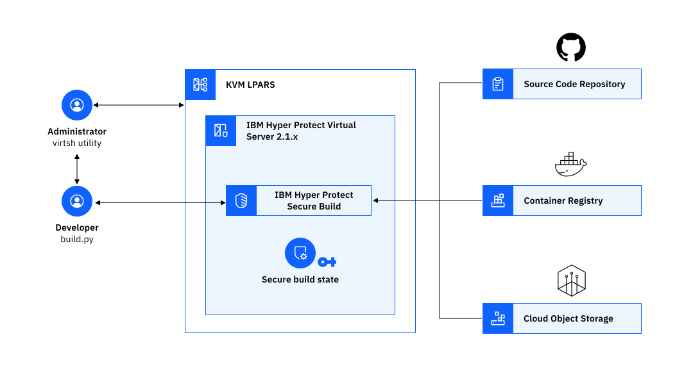

---

copyright:
  years: 2023, 2024
lastupdated: "2024-01-22"

keywords: secure build, ci/cd, supply chain

subcollection: confidential-computing

---

{{site.data.keyword.attribute-definition-list}}

# Secure workload supply chain
{: #devsecops}

Whether you are building a cloud native application, or on an application modernization journey, you can now do both with peace of mind by leveraging IBM’s Secure Execution technology. Containerizing applications within a confidential computing environment ensures that your applications are protected and isolated, even the IBM admin doesn’t have access.
{: shortdesc}

## Challenges
{: #devsecops-challenge}

As workload supply chain comprises multiple stages from produce to deliver, data and code are transferred in each stage. How can you protect them from unauthorized access and malicious tampering during the entire process? 

{: caption="Figure 1. Workload supply chain challenge" caption-side="bottom"}

Although [Supply-chain Levels for Software Artifacts (SLSA)](https://slsa.dev/){: external} has established a security framework for enterprises to follow to improve integrity, secure packages, and mitigate threats, there are several areas still outside of SLSA's current framework:

- Quality of code: SLSA cannot tell you whether the source code that was written follows secure coding practices.
- Producer trust: SLSA's Build Track protects from tampering after or during the build. However, they cannot address organizations that purposefully create malicious software.
- Transitive trust for dependencies: An artefacts SLSA level does not depend on the level of its dependencies. Currently there is no SLSA level that can refer to both an artifact and its transitive dependencies.

## How can the Confidential Services Platform help?
{: #devsecops-hp}

By using Hyper Protect Secure Build technology, a trusted container image can be built within a secure enclave that is provided by IBM Hyper Protect Virtual Servers. The enclave is highly isolated, where developers can access the container only by using a specific API, and the cloud administrator cannot access the contents of the container. Therefore, the image that is built can be highly trusted. Specifically, the build server cryptographically signs the image and a manifest (which is a collection of materials that are used during the build, for audit purposes). Since the enclave protects the signing of keys within the enclave, the signatures can be used to verify whether the image and manifest files are from the Hyper Protect Secure Build and not elsewhere. The following diagram illustrates the secure build process:

{: caption="Figure 1. Secure Build with Hyper Protect" caption-side="bottom"}

You can refer to the following architectures to use Secure Build either on cloud or on premises:

### On cloud
{: #devsecops-hp-on-cloud}

{: caption="Figure 1. Secure Build on IBM Cloud" caption-side="bottom"}

### On-prem
{: #devsecops-hp-on-prem}

{: caption="Figure 1. Secure Build for on-premises" caption-side="bottom"}

With Hyper Protect Secure Build, you can also benefit from the following aspects:

- Help prevent known defects from entering the production environment
- Define mandatory security checks and ensure that building non-compliant artifacts fail
- Analyze the dependencies used for security issues
