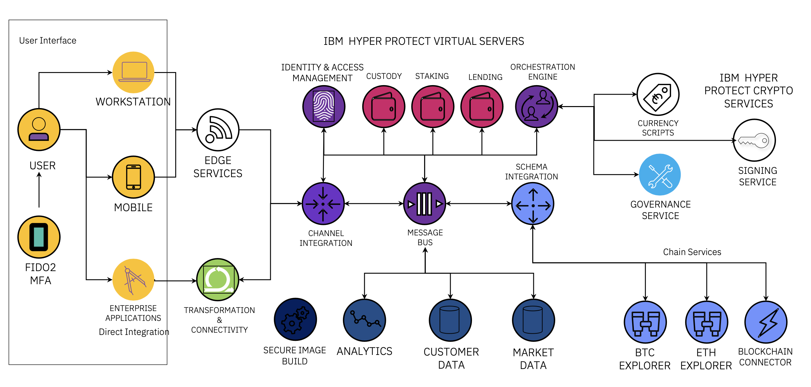

---

copyright:
  years: 2023, 2023
lastupdated: "2023-11-13"

keywords: digital asset, digital wallet, nft

subcollection: confidential-computing

---

{{site.data.keyword.attribute-definition-list}}

# Digital assets custody and governance 
{: #digital-assets}

Confidential computing on IBM Cloud helps build a trusted platform for digital assets, non-fungible tokens (NFTs), and policy enforcement. Entities can store and transfer high-value digital assets in highly secure wallets while achieving reliability at scale.
{: shortdesc}

## Challenges
{: #da-challenge}

In a digital assets infrastructure, maintaining control over private keys is extremely challenging and poses a major risk, especially when managing thousands or millions of wallets. Loss of control of an account private key through cyber-attack or mishandling can result in irreversible asset loss.

## How can the Hyper Protect Platform help?
{: #da-hp}

The Hyper Protect Platform provides the building blocks to create reliable and scalable end-to-end solutions for managing, transferring, and storing large quantities of digital assets in highly secure wallets. Customers can utilize Secure Build to further enhance their security posture. This technology validates code before it is deployed to a container, ensuring that only verified code is allowed to run, ultimately reducing malware threats, and misconfigurations.

To securely provide a Digital Assets Infrastructure you can leverage features of the Hyper Protect Platform like the Trusted Container Runtime, memory protection and data in use protection, disk encryption, attestation, the contract mechanism, and separation of duty.

The following diagram illustrates a common architecture to use Hyper Protect Services for digital asset solutions:

{: caption="Figure 1. Using Hyper Protect Services for digital assets" caption-side="bottom"}

- Key creation, key derivation, and further cryptographic operations like encryption and signing are processed using Hyper Protect Crypto Services backed by IBM LinuxONE and FIPS 140-2 Level 4 certified hardware.
- Cryptographic keys, access tokens, and digital wallets are kept inside the Hyper Protect Virtual Server instance and cannot be accessed even by privileged actors.
- Transactions are processed within isolated enclaves, namely Hyper Protect Virtual Servers, to ensure its confidentiality and integrity.
