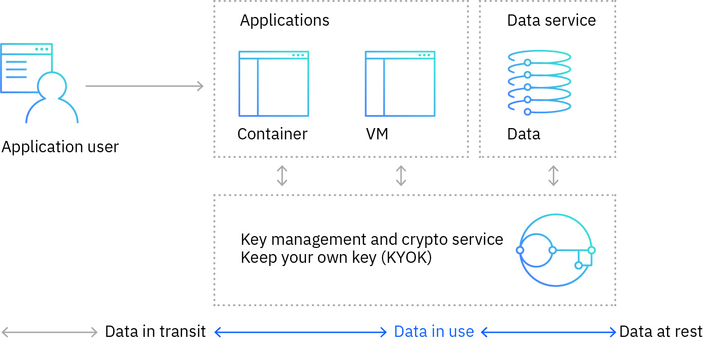
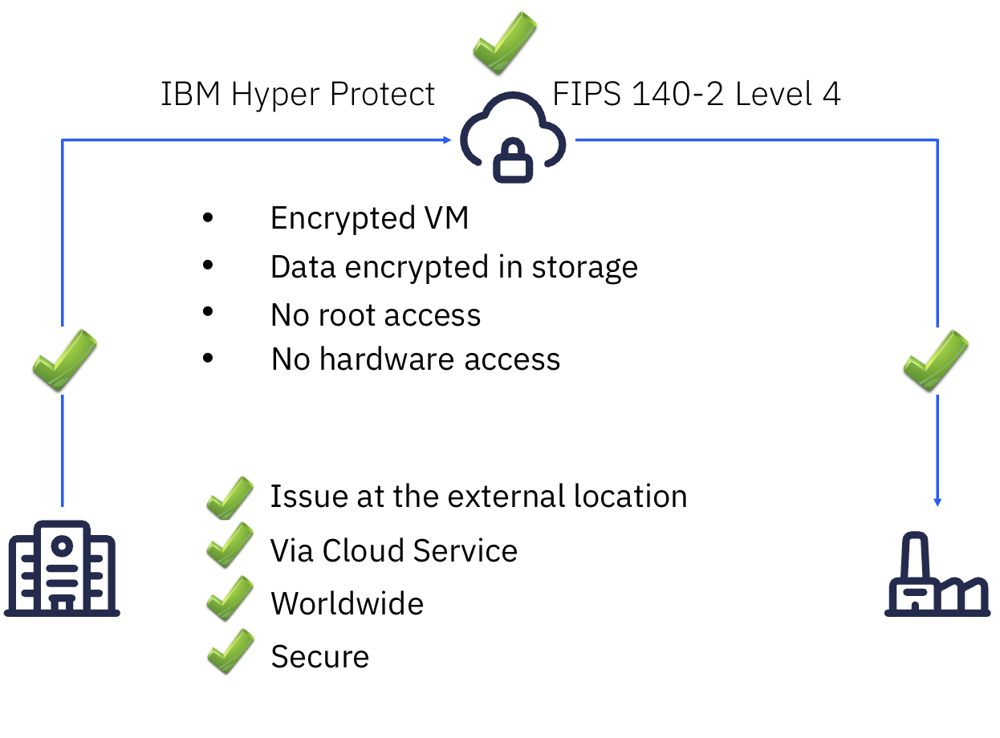

---

copyright:
  years: 2023, 2024
lastupdated: "2024-10-09"

keywords: containerized workloads, containerization

subcollection: confidential-computing

---

{{site.data.keyword.attribute-definition-list}}

# Secure containerized workloads
{: #scp}

Containerizing applications on the Confidential Services Platform with confidential computing ensures that your applications are always protected. Protected against a third party, including the cloud provider itself and own insider attacks on all levels of the stack of choice and with different scope.
{: shortdesc}

## Challenges
{: #scp-challenge}

Enterprises are moving their applications to cloud to reduce cost, simplify and consolidate their IT environment, and take advantage of hybrid cloud flexibility. However, these applications contain many types of sensitive, sometimes regulated data that needs to be protected. Examples for this are applications in the financial services, healthcare, government, and nonprofit domains.

The biggest barrier for bringing sensitive applications to the cloud is that the cloud infrastructure is owned and operated by the cloud provider. Users are concerned: Is my data and my customers‘ data safe in the cloud? Can the cloud provider access my data? How do I meet regulatory and privacy requirements?

## How can the Confidential Services Platform help?
{: #scp-hp}

The Confidential Services Platform provides isolated enclaves for running your applications. The contents of the enclave — the data being processed, and the techniques that are used to process it — are accessible only to authorized programming code, and are invisible and unknowable to anything or anyone, including the cloud provider. The Confidential Services Platform protects your sensitive data in a holistic approach — spanning compute, containers, databases, and encryption.

{: caption="Confidential Services Platform protects data across its lifecycle" caption-side="bottom"}

With the Confidential Services Platform, you can take advantage of hybrid cloud for application modernization and design of cloud native and containerized applications, and ensure the compliance with regulations, data sovereignty and data protection requirements. The Confidential Services Platform also ensures protection of trade secrets and intellectual property that can be part of the application, like proprietary business logic, private AI training data and AI models.

Take cloud printing as an example. With Hyper Protect Services, you can build the most secure, scalable, and flexible cloud output solution. Your data is protected at all times – at rest, in transit as well as in use. By deploying containerized agents, you can print at remote and 3rd-party locations with minimal administrative effort. As a cloud hub, you can also use it for pick-up printing.

{: caption="Cloud printing with Hyper Protect" caption-side="bottom"}
