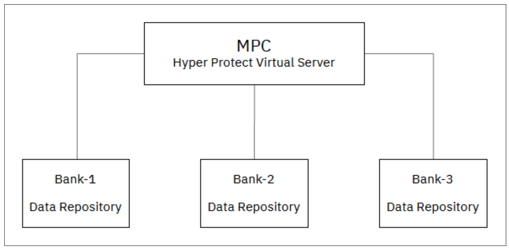
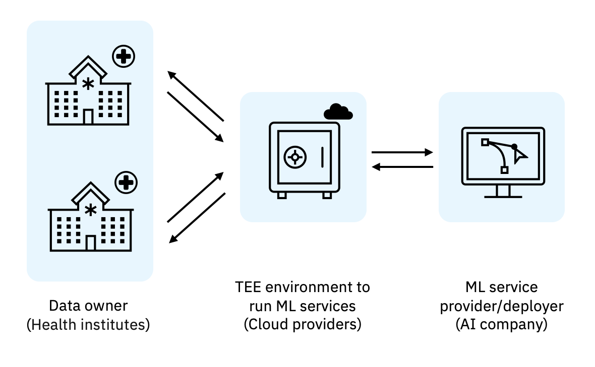
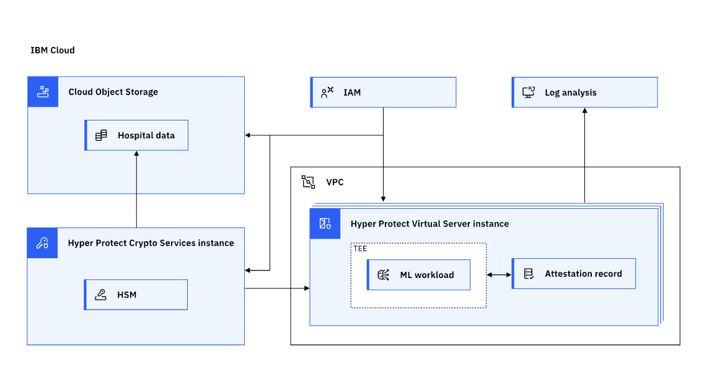

---

copyright:
  years: 2023, 2023
lastupdated: "2023-11-13"

keywords: smpc, multi party collaboration, multi party computation

subcollection: confidential-computing

---

{{site.data.keyword.attribute-definition-list}}

# Secure multi-party computation and collaboration
{: #smpc}

As various entities collaborate towards a common goal: the need for the individual data privacy as well as correct computation output. With confidential computing, it is possible to enable distributed multi-party computation and collaboration, where participants are ensured that their data or insights are protected even when being calculated outside their direct control.
{: shortdesc}

## Challenges
{: #smpc-challenge}

In multi-party collaborations (MPC), the biggest concern is how can the confidentiality and integrity of the data be preserved? For example, secure federated learning can be applied to cases in which multiple parties have private data that needs to be combined and analyzed without exposing the underlying data or machine learning models to any of the other parties. This technology can be applied to preventing fraud in financial services (as shown is Figure 1), detecting or developing cures for diseases in the healthcare industry (as shown in Figure 2), or gaining business insights.As the following diagram shows, multiple hospitals could combine data to train a machine learning model to clinically analyze medical images.

{: caption="Figure 1. Banks collaborate to find patterns of anti-money laundering" caption-side="bottom"}

{: caption="Figure 2. Hospitals share data to help drug development and disease diagnostics" caption-side="bottom"}

## How can the Hyper Protect Platform help?
{: #smpc-hp}

With the Hyper Protect Platform, each party brings encrypted data to a confidential computing enclave (such as a Hyper Protect Virtual Server) where data can be safely un-encrypted and processed. Organizations can now ensure that data is protected against tampering and compromise, and data sovereignty and privacy regulations can be fulfilled. This includes threats within the partnering organizations and validating the integrity of the code processing that data. The data can be combined and analyzed and the results can be sent in an encrypted format back to each party. Data remains protected throughout the entire process: while in transit, in use and at rest. The following diagram illustrates a common SMPC implementation architecture with the Hyper Protect Platform:

{: caption="Figure 3. Hyper Protect implementation in SMPC" caption-side="bottom"}

- Sensitive data is processed within Hyper Protect Virtual Servers that are isolated computation enclaves with attestation records.
- Data is stored in Cloud Object Storage, encrypted with keys generated in Hyper Protect Crypto Services backed by IBM LinuxONE and FIPS 140-2 Level 4 certified hardware security module (HSM).
- Hyper Protect Crypto Services provide the third seeds for generating the LUKS passphrase to encrypt your data volume attached in Hyper Protect Virtual Server.
