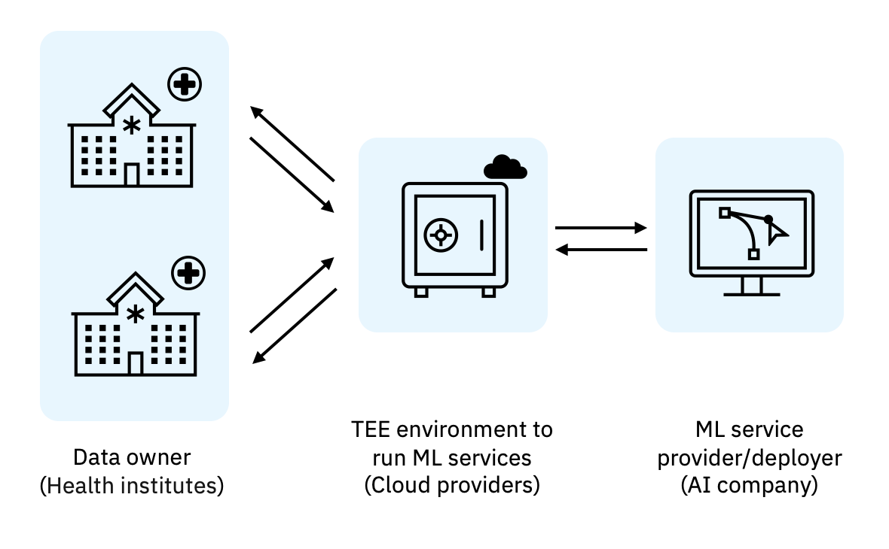

---

copyright:
  years: 2023, 2023
lastupdated: "2023-08-02"

keywords: 

subcollection: confidential-computing

---

{{site.data.keyword.attribute-definition-list}}

# Secure multi-party computation
{: #smpc}

How to leverage confidential computing in secure multi-party computation.

As various entities collaborate towards a common goal the need for the individual data privacy as well as intellectual property protection remains. While MPC leverages cryptography a key aspect of this model is the protection from each other. With Confidential Computing it is possible to enable distributed MPC, where participants are ensured their data or insights are protect even when being calculated outside their direct control.

{: caption="Figure 1. Secure multi-party computation" caption-side="bottom"}

{: caption="Figure 2. Hyper Protect implementation" caption-side="bottom"}