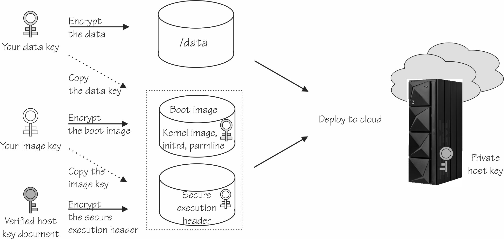
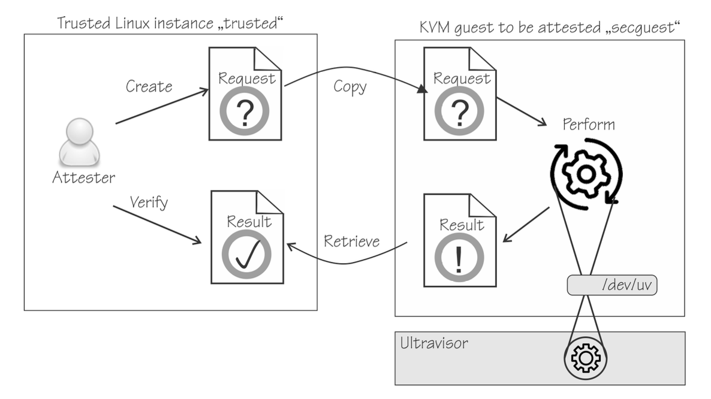

---

copyright:
  years: 2024
lastupdated: "2024-01-22"

keywords: Confidential Services Platform, concepts.

subcollection: confidential-computing

---

{{site.data.keyword.attribute-definition-list}}

# Concepts in Confidential Services Platform
{: #hyper-protect-concepts}

Understand the common concetps in the Confidential Services Platform.

TO-DO: Need a diagram or something to explain those key concepts and their relationships.

## Secure Execution
{: #secure-execution}

IBM Secure Execution for Linux protects data of workloads that run in a KVM guest from being inspected or modified by the server environment. In particular, no hardware administrator, no KVM code, and no KVM administrator can access the data in a guest that was started as an IBM Secure Execution guest. Only the workload owner can access the workload and data.

The Secure Execution for Linux is a continuation and expansion of well-known security features
of IBM Z and LinuxONE, and is available as part of the following hardwares:
   * IBM z15 and z16
   * IBM LinuxONE III and LinuxONE 4

Secure Execution for Linux is built to apply Zero Trust policies. Encryption combined with architectural, development and manufactural processes can establish technical assurance. Regulation and Audition require proof that the assumed environment and workload is present as well as appropriate personalisation of instances has happened. A common way to provide such proof are attestation methods or through an attestation record. 

To achieve this, the zSystem firmware contains a so-called Ultravisor, a trusted firmware component, which enforces memory protection and offers the owner of a given KVM guest to securely pass secret information to the Ultravisor by using the public host key included in the host key document.

{: caption="Figure 2. IBM Secure Execution for Linux" caption-side="bottom"}}

To process the secret information, the Ultravisor uses the matching private host key to run the workload in the secure-execution mode. The following diagram shows a simplified view of the keys that are involved in all stages of securing the workload. The private host key is specific to an IBM z or LinuxONE server and is hardware protected. 

{: caption="Figure 3. Securing the workload" caption-side="bottom"}}

## Contract
{: #contract}

To run your workload in the secure-execution mode and provide the required configuration data to your cloud admin, you need to use a contract to convey such information.

The contract in the Confidential Services Platform ensures the confidentialality and integrity of the workload details and deployment configuration, and it has different meanings in terms of confidential VMs and orchestrated confidential containers running in the secure-execution mode. 

| Contract | For confidential VMs | For orchestrated confidential containers |
|-----|-----|-----|
| Description|  A definition file in the YAML format defines what gets run inside the secure-execution mode.  |   A definition file in the YAML format defines what is allowed to be run inside the secure-execution peer pod and what commands can cross the boundary.|
{: caption="Table 1. Contracts" caption-side="bottom"}}

For similarities:

* Both contracts have encrypted `env` and `workload` sections to prevent the contents of those sections from being read by unauthorised personas
* Both contracts are signed over those sections to prevent unauthorised personas modifying them.
* For both contracts, the `env` and `workload` can be encrypted and the signature generated by using the hpcr terraform provider.
* Both contracts have some shared fields, for example the section that contains the image repositories and image pull credentials is shared in the HPCR and IKSwHP contracts

For differences:

* The HPCR contract contains a recipe like a Docker compose or Podman play file that tells the HPCR VSI what gets run inside SE. The IKSwHP contract does not define what gets run but defines what is allowed to be run through restrictions that include the list of allowed Kata container runtime endpoints and the rego policy based restrictions on allowed endpoints.
* What gets run inside the IKSwHP SE peer pod VSIs is determined by the Kubernetes controlling resource (e.g., a deployment or daemonset, more rarely an single pod) that is bound to the contract. The controlling resource defines the containers that actually run in the pod (but if the contract disallows those containers, the container will not be permitted to run)

**To-do: might need a diagram to illustrate each scenario**

## Attestation
{: #attestation}

Attestation is the evidence that the KVM guest runs in secure-execution mode. If the KVM guest was built for one particular IBM Z or LinuxONE server, the attestation also verifies that the KVM guest runs on that specific server.

If the KVM guest was built for several servers, the attestation only verifies that the KVM guest runs on one of those servers.

Reasons for IBM Secure Execution attestation include auditing, image personalization, and aligning with other confidential computing architectures.

With cybersecurity threats developing and calling for mitigation, attestation is being integrated into workflows for cloud-based workloads. IBM Secure Execution as a superior security architecture provides an attestation function.

The following examples illustrate possible uses of attestation.

* **Auditing**  Your organization might mandate that an attestation on cybersecurity be included in each department's annual report. That is, annually, a report must be created that shows that cybersecurity measures are in place. This report includes showing that all workloads that run at a cloud provider are safe.
* **Personalization**  Assume that a KVM guest in secure execution mode runs a generic workload, for example Soda Company Recipe Store. This workload can be bought and used by different soda companies. These companies would want to personalize the KVM guest with individual secrets, such as replacing SSL or TLS keys. But before that they want to verify the integrity of the base image.
* **Unlocking data**  A company provides data in the form of a file system encrypted with LUKS. A KVM guest running in secure execution mode is to process this data. An attester performs the attestation, and only sends the LUKS key to this guest after verifying its integrity. This procedure might be mandated by an external workflow.

{: caption="Figure 4. Attestation process" caption-side="bottom"}}

