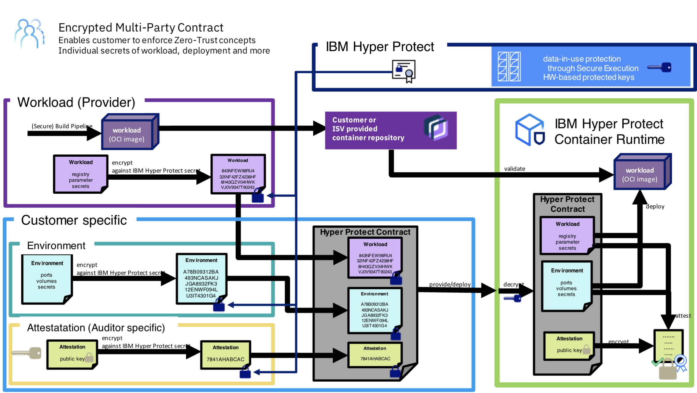

---

copyright:
  years: 2023
lastupdated: "2023-12-14"

keywords: hyper protect, hyper protect services, hyper protect platform, kvm, s390x, overview, introduction

subcollection: confidential-computing

---

{{site.data.keyword.attribute-definition-list}}

# Overview of Hyper Protect Platform
{: #hyper-protect-overview}

IBM Hyper Protect Platform represents the cutting-edge in confidential computing, designed to secure sensitive data and mission-critical applications in hybrid cloud environments. The platform leverages IBM Z and LinuxONE systems' Secure Execution technology, providing a robust foundation for creating protected kernel virtual machines (KVM) tailored for the s390x architecture. This secure execution environment encapsulates workloads within secure enclaves, effectively shielding them from unauthorized access, even from privileged users such as cloud administrators.
{: shortdesc}

One of the key advantages of the Hyper Protect Platform is its ability to provide end-to-end security for data at rest, in motion, and in use. By utilizing this platform, enterprises can confidently move sensitive applications to the cloud, knowing that their code and data are safeguarded throughout their lifecycle. This is particularly crucial for industries with stringent data protection requirements, such as financial services, healthcare, and government sectors.

## Secure Execution
{: #feature-se}

The IBM Hyper Protect Platform leverages [IBM Secure Execution for Linux technology](https://www.ibm.com/docs/en/linux-on-systems?topic=virtualization-introducing-secure-execution-linux){: external}, which is a hardware-based security technology and was introduced with the IBM z15® and IBM® LinuxONE III generation systems for Kernel Virtual Machines (KVM). It protects data of workloads that run in a KVM guest from being inspected or modified by the server environment. In particular, no hardware administrator, no KVM code, and no KVM administrator can access the data in a guest that was started as an IBM Secure Execution guest. Only the workload owner can access the workload and data. This means that no hardware administrator, KVM code, or KVM administrator can compromise the sanctity of the data, effectively isolating the workload from any external interference.

The Secure Execution for Linux is a continuation and expansion of well-known security features of IBM Z and LinuxONE, and is available as part of the following hardwares:

   * IBM z15 and z16
   * IBM LinuxONE III and LinuxONE 4

The Ultravisor, a trusted firmware component within the IBM Z and LinuxONE, enforces memory protection and facilitates the secure transfer of sensitive information. It allows the owner of a KVM guest to securely pass secret information to the Ultravisor using the public host key, which is part of the host key document. This document functions similarly to a certificate, with IBM acting as the trusted third party to verify its authenticity.

{: caption="Figure 1. IBM Secure Execution for Linux" caption-side="bottom"}

To process the secret information, the Ultravisor uses the matching private host key to run the workload in the secure-execution mode. The following diagram shows a simplified view of the keys that are involved in all stages of securing the workload. The private host key is specific to an IBM Z or LinuxONE server and is hardware protected. 

{: caption="Figure 2. Securing the workload" caption-side="bottom"}

When you start a KVM guest or deploy a workload in IBM Secure Execution mode, the boot image, guest memory, and guest state are all protected against being observed or modified by the hosting environment. Across its entire lifecycle, such a guest has its confidentiality and integrity protected, from the moment the image is built, through the boot process and the running of the virtual server, until its termination.

## Separation of duties
{: #feature-duty-separation}

The Hyper Protect Platform supports separation of duty with predefined personas. The predefined personas as described below are based on least privilege and zero trust principles. There is no assumed trust that what is expected to be deployed is in fact what gets deployed.

- **Container Image Provider**

  A workload can consist of one or more container images which in combination deliver an expected solution. To ensure the integrity of the solution we must be able to verify the individual container images which deliver the solution, and ensure supply chain integrity through this.
  All container images used are expected to be built in a secure manner that reassures the Workload Provider of their supply chain integrity and provides a way to verify the appropriate container images are being deployed. This means a signature is securely established over the generated container image and the signature provides a means for a Workload Deployer Persona to establish trust in the container image being deployed.

- **Workload Provider Persona**

  This may be the same persona as the Container Image Provider, but the workload may also combine container images from different sources. The workload provider persona defines the container(s) and environment requirements for the solution to be deployed. There is no trust given to allow any other persona to change the container images being used to provide the workload or to redefine the environment requirements specified by the workload provider.

- **Workload Deployer Persona**

  This persona is responsible for deploying the workload using the (cloud) infrastructure available. The Workload Provider provides the encrypted workload contract section and identifies and communicates to the Workload Deployer the environment required to provide the workload to an end user. This allows the Workload Deployer to supplement the definition provided by the workload provider with instance/environment specific information (logging, storage etc).

  The workload deployer is responsible for the service availability. They

    * can control the networking, compute and storage resources made available to instance - can influence network traffic in and out of a provided workload
    * cannot change the workload to be deployed
    * cannot change the Workload Provider’ environment expectations.

  If they do change the environment expectations, either the workload will not start, or the Auditor will not verify the environment when the workload is deployed.

- **Auditor**

  Since there is no “assumed” trust between the Workload Provider and other personas we must ensure at runtime that the workload is not deployed in a manner which breaks the Workload Provider’s or the Workload Deployer’s expectations.

  The Auditor is the persona with responsibility for verifying that a deployed workload is both the workload expected and deployed to the expected environment. They do this by obtaining and verifying a trusted attestation record at runtime. The contents of this record can be verified against workload and environment expectations and details are covered in future section of this document.

- **Infrastructure/System Admin Persona**

  This role includes the system (cloud) administrator of a compute, storage, and network or support persona of the infrastructure like a Site Reliability Engineer (SRE). They will have responsibility for the underlying hardware but must not be able to use the capabilities this role offers to access confidential data or subvert the workload providers definition of the workload and expected environment. The use of Secure Execution achieves this through protecting the memory used by the workload from all external access at runtime, and the use of an encrypted Contract protects the intended workload and environment definitions at deployment time.

## Contract mechanism
{: #feature-contract}

The contract is essential for the workload lifecycle within the secure execution environment. The workload itself and its contract are passed into the container runtime environment in the KVM guest during the deployment, and this container runtime environment is also known as Hyper Protect Container Runtime (HPCR). To safeguard the contract, a public/private key pair is used to encrypt the contract contents. This public/private key pair helps maintain the confidentiality of the contract during its distribution and before it is decrypted by the HPCR image.

{: caption="Figure 3. Contract mechanism" caption-side="bottom"}

The encryption of the contract is carried out using the public X509 certificate associated with the Contract Encryption public key. This public key is published by IBM, allowing any persona to validate it out-of-band, which means that it can be validated independently of the system that uses it, ensuring the trustworthiness of the encryption mechanism.

Upon receipt of the contract by the HPCR image, the contract is decrypted by the different components or services within it. This process involves decrypting the contract (if encrypted), validating the contract schema, checking for contract signatures, and creating a passphrase to encrypt the disk device. After these steps, the container specified in the contract is brought up and becomes operational.

For more information, see [About the contract](/docs/vpc?topic=vpc-about-contract_se){: external}.

## Attestation
{: #feature-attestation}

Attestation is the evidence that the KVM guest runs in secure execution environment. If the KVM guest was built for one particular IBM Z or LinuxONE server, the attestation also verifies that the KVM guest runs on that specific server. If the KVM guest was built for several servers, the attestation only verifies that the KVM guest runs on one of those servers.

With cybersecurity threats developing and calling for mitigation, attestation is being integrated into workflows for cloud-based workloads. IBM Secure Execution as a superior security architecture provides an attestation function.

{: caption="Figure 4. Attestation process" caption-side="bottom"}

Reasons for IBM Secure Execution attestation include auditing, image personalization, and aligning with other confidential computing architectures. The following examples illustrate possible uses of attestation:

* **Auditing**  Your organization might mandate that an attestation on cybersecurity be included in each department's annual report. That is, annually, a report must be created that shows that cybersecurity measures are in place. This report includes showing that all workloads that run at a cloud provider are safe.
* **Personalization**  Assume that a KVM guest in secure execution mode runs a generic workload, for example Soda Company Recipe Store. This workload can be bought and used by different soda companies. These companies would want to personalize the KVM guest with individual secrets, such as replacing SSL or TLS keys. But before that they want to verify the integrity of the base image.
* **Unlocking data**  A company provides data in the form of a file system encrypted with LUKS. A KVM guest running in secure execution mode is to process this data. An attester performs the attestation, and only sends the LUKS key to this guest after verifying its integrity. This procedure might be mandated by an external workflow.
