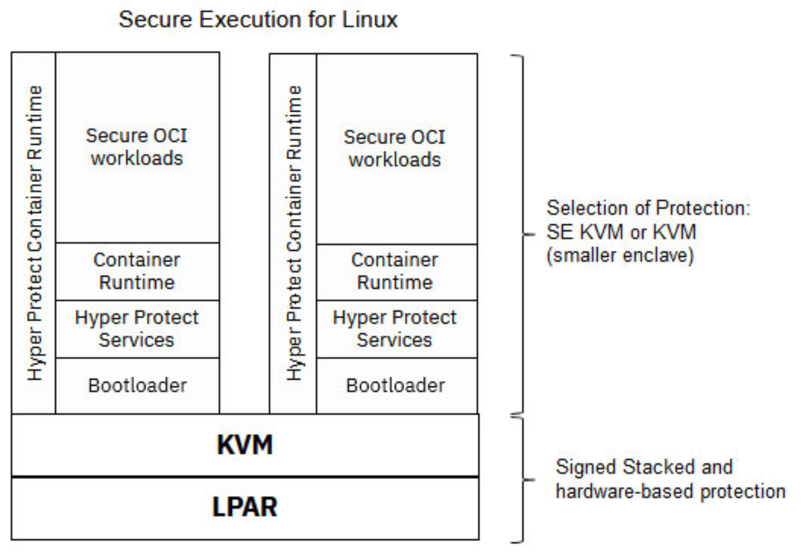

---

copyright:
  years: 2023, 2023
lastupdated: "2023-11-24"

keywords: hyper protect, hyper protect services, hyper protect platform

subcollection: confidential-computing

---

{{site.data.keyword.attribute-definition-list}}

# Hyper Protect Platform on IBM Z and LinuxONE
{: #hyper-protect-overview}

The IBM Hyper Protect Platform as the IBM confidential computing solution can help solve the data protection concerns in a hybrid cloud environment, on-premises environment, and as an IBM Cloud-based SaaS model.
{: shortdesc}

## Introducing the Hyper Protect Platform
{: #hp-introduction}

The IBM Hyper Protect Platform leverages [IBM Secure Execution for Linux technology](https://www.ibm.com/docs/en/linux-on-systems?topic=virtualization-introducing-secure-execution-linux){: external}. This is a hardware-based security technology, which was introduced with the IBM z15® and IBM® LinuxONE III generation systems for Kernel Virtual Machines (KVM). It is designed to provide scalable isolation for individual workloads to help protect them from not only external attacks, but also insider threats. Secure Execution can help protect and isolate workloads on-premises, or on IBM Z and IBM® LinuxONE hybrid cloud environments. The following figure illustrates the overall stack for the Hyper Protect Platform.

{: caption="Figure 1. Hyper Protect Platform stack overview" caption-side="bottom"}

By reducing the size of the protected environment with the Hyper protect Platform, it is possible to enhance data protection from potential attacks on the system from inside and outside. By the ability to protect data-in-use by individual KVMs it is possible to increase flexibility and scalability of the solution, which also becomes independent of underlying software stack.

Based on the stack, the following figure illustrated the protection boundary in Hyper Protect:

{: caption="Figure 2. Protection boundary" caption-side="bottom"}

## Features of the Hyper Protect Platform
{: #hp-features}

The features offered by the Hyper Protect Platform create the foundation for an end-to-end secure environment. This platform provides protection of code and data while supporting a consistent developer experience.

### Secure Execution
{: #feature-se}

IBM Secure Execution for Linux protects data of workloads that run in a KVM guest from being inspected or modified by the server environment. In particular, no hardware administrator, no KVM code, and no KVM administrator can access the data in a guest that was started as an IBM Secure Execution guest. Only the workload owner can access the workload and data.

The Secure Execution for Linux is a continuation and expansion of well-known security features of IBM Z and LinuxONE, and is available as part of the following hardwares:

   * IBM z15 and z16
   * IBM LinuxONE III and LinuxONE 4

Secure Execution for Linux is built to apply Zero Trust policies. Encryption combined with architectural, development and manufactural processes can establish technical assurance. Regulation and Audition require proof that the assumed environment and workload is present as well as appropriate personalization of instances has happened. A common way to provide such proof are attestation methods or through an attestation record. 

To achieve this, the zSystem firmware contains a so-called Ultravisor, a trusted firmware component, which enforces memory protection and offers the owner of a given KVM guest to securely pass secret information to the Ultravisor by using the public host key included in the host key document.

{: caption="Figure 2. IBM Secure Execution for Linux" caption-side="bottom"}

To process the secret information, the Ultravisor uses the matching private host key to run the workload in the secure-execution mode. The following diagram shows a simplified view of the keys that are involved in all stages of securing the workload. The private host key is specific to an IBM z or LinuxONE server and is hardware protected. 

{: caption="Figure 3. Securing the workload" caption-side="bottom"}

### Bring Your Own Image - Hyper Protect Container Runtime
{: #feature-hpcr}

The Hyper protect Platform provides a Container Runtime (a trusted container runtime which provides the benefits and properties of a TEE) for OCI images. It supports any OCI images built for IBM LinuxONE and IBM Z, which means images do not need to be adapted specifically for Hyper Protect. The application code does not need to be changed and does not need to adhere to a specific programming model. You can use your existing application code and images and bring these to the Hyper Protect Platform.

The following figure illustrates the main components in Hyper Protect Container Runtime:

{: caption="Figure 2. Hyper Protect Container Runtime on public and Hybrid cloud" caption-side="bottom"}

### Separation of duties
{: #feature-duty-separation}

The Hyper Protect Platform supports separation of duty with predefined personas. The predefined personas as described below are based on least privilege and zero trust principles. There is no assumed trust that what is expected to be deployed is in fact what gets deployed.

- **Container Image Provider**

  A workload can consist of one or more container images which in combination deliver an expected solution. To ensure the integrity of the solution we must be able to verify the individual container images which deliver the solution, and ensure supply chain integrity through this.
  All container images used are expected to be built in a secure manner that reassures the Workload Provider of their supply chain integrity and provides a way to verify the appropriate container images are being deployed. This means a signature is securely established over the generated container image and the signature provides a means for a Workload Deployer Persona to establish trust in the container image being deployed.

- **Workload Provider Persona**

  This may be the same persona as the Container Image Provider, but the workload may also combine container images from different sources. The workload provider persona defines the container(s) and environment requirements for the solution to be deployed. There is no trust given to allow any other persona to change the container images being used to provide the workload or to redefine the environment requirements specified by the workload provider.

- **Workload Deployer Persona**

  This persona is responsible for deploying the workload using the (cloud) infrastructure available. The Workload Provider provides the encrypted workload contract section and identifies and communicates to the Workload Deployer the environment required to provide the workload to an end user. This allows the Workload Deployer to supplement the definition provided by the workload provider with instance/environment specific information (logging, storage etc).

  The workload deployer is responsible for the service availability. They

    * can control the networking, compute and storage resources made available to instance - can influence network traffic in and out of a provided workload
    * cannot change the workload to be deployed
    * cannot change the Workload Provider’ environment expectations.

  If they do change the environment expectations, either the workload will not start, or the Auditor will not verify the environment when the workload is deployed.

- **Auditor**

  Since there is no “assumed” trust between the Workload Provider and other personas we must ensure at runtime that the workload is not deployed in a manner which breaks the Workload Provider’s or the Workload Deployer’s expectations.

  The Auditor is the persona with responsibility for verifying that a deployed workload is both the workload expected and deployed to the expected environment. They do this by obtaining and verifying a trusted attestation record at runtime. The contents of this record can be verified against workload and environment expectations and details are covered in future section of this document.

- **Infrastructure/System Admin Persona**

  This role includes the system (cloud) administrator of a compute, storage, and network or support persona of the infrastructure like a Site Reliability Engineer (SRE). They will have responsibility for the underlying hardware but must not be able to use the capabilities this role offers to access confidential data or subvert the workload providers definition of the workload and expected environment. The use of Secure Execution achieves this through protecting the memory used by the workload from all external access at runtime, and the use of an encrypted Contract protects the intended workload and environment definitions at deployment time.

### Encrypted contract mechanism
{: #feature-contract}

The Hyper protect Platform uses a contract mechanism to enable the workload provider and the workload deployer to define the container images and the properties of the application and its environment in a secure way. The contract is a document comprising multiple sections which can be independently encrypted. The contract can be signed and is provided during deployment. During initialization or boot of instance, the Hyper Protect Container Runtime decrypts the contract, verifies the contract signature, creates the passphrase to encrypt disk devices based on the seeds contained in the contract, starts the container images defined in the contract and sets up the environment according to the properties defined in the contract, by setting environment variables.

The contract has several sections, two of these are mandatory:

- Workload (mandatory)

  This section contains the definition of the application workload in form of a docker compose file or a pod descriptor. It defines one or more container images, the container image registry where it resides as well as information and credentials required to download and validate the image.

  The section can also comprise information about data volumes, the seed for deriving the disk encryption passphrase, environment variables.

- env (mandatory)

  This section describes the environment for the application. It comprises several subsections to define information about logging (where the logs should be sent to), data volumes, another seed for deriving the disk encryption passphrase, environment variables and optionally the public part of the contract signing key.

- attestationPublicKey (optional)
  
  This section provides a public RSA key, which is used to encrypt the attestation document.

- envWorkloadSignature (optional)

  This section contains the signature of the other sections of the contract, allowing to pin a specific workload part to the env part. An Auditor, Workload Provider, or Workload Deployer person can choose to sign a contract before it is passed as input.

Only the Hyper Protect Platform can decrypt an encrypted contract. Therefore, by using the contract mechanism the Workload Provider (persona) can define and encrypt the workload section of the contract, then pass it to the Workload Deployer (persona). This way, the Workload Provider can hide the content of the workload section of the contract like the actual container images of the application from the Workload Deployer, while still allowing the Workload Deployer to provision [Hyper Protect Virtual Server](/docs/confidential-computing?topic=confidential-computing-hyper-protect-products) instances.

The Workload Deployer can define and encrypt the env section of the contract. He then combines the workload and the env section, optionally adds the envWorkloadSignature and the attestationPublicKey sections and then deploys the [Hyper Protect Virtual Server](/docs/confidential-computing?topic=confidential-computing-hyper-protect-products) instance using the contract. As both sections of the contract are encrypted, no intermediate infrastructure component and no other party including privileged actors can view the contents of the contract. By adding the envWorkloadSignature, the contract can be protected against modification or tampering.

### Attestation
{: #feature-attestation}

Attestation is the evidence that the KVM guest runs in secure-execution mode. If the KVM guest was built for one particular IBM Z or LinuxONE server, the attestation also verifies that the KVM guest runs on that specific server. If the KVM guest was built for several servers, the attestation only verifies that the KVM guest runs on one of those servers.

With cybersecurity threats developing and calling for mitigation, attestation is being integrated into workflows for cloud-based workloads. IBM Secure Execution as a superior security architecture provides an attestation function.

{: caption="Figure 4. Attestation process" caption-side="bottom"}

Reasons for IBM Secure Execution attestation include auditing, image personalization, and aligning with other confidential computing architectures. The following examples illustrate possible uses of attestation:

* **Auditing**  Your organization might mandate that an attestation on cybersecurity be included in each department's annual report. That is, annually, a report must be created that shows that cybersecurity measures are in place. This report includes showing that all workloads that run at a cloud provider are safe.
* **Personalization**  Assume that a KVM guest in secure execution mode runs a generic workload, for example Soda Company Recipe Store. This workload can be bought and used by different soda companies. These companies would want to personalize the KVM guest with individual secrets, such as replacing SSL or TLS keys. But before that they want to verify the integrity of the base image.
* **Unlocking data**  A company provides data in the form of a file system encrypted with LUKS. A KVM guest running in secure execution mode is to process this data. An attester performs the attestation, and only sends the LUKS key to this guest after verifying its integrity. This procedure might be mandated by an external workflow.
