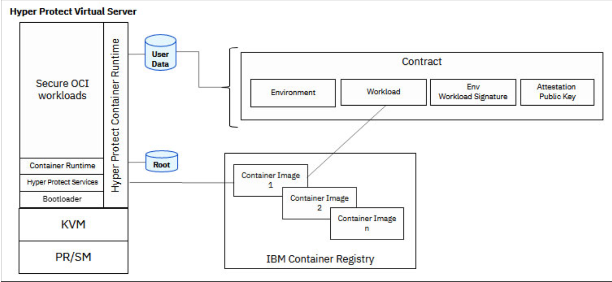
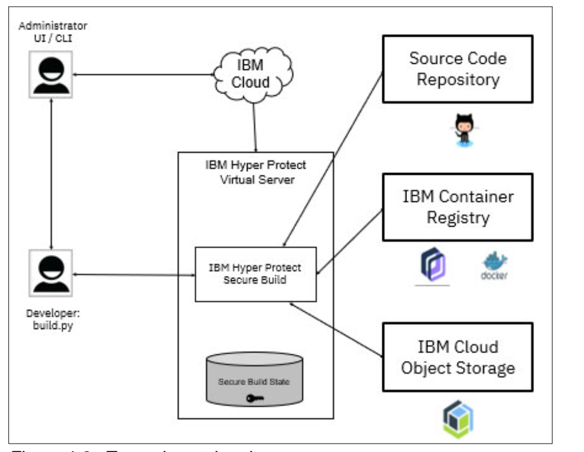
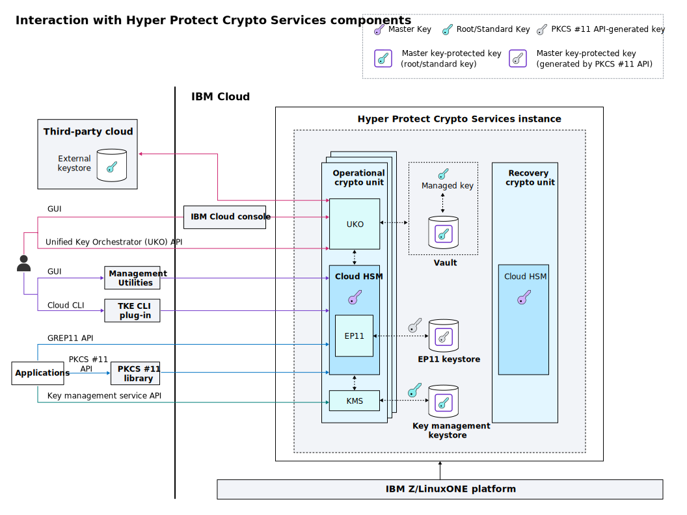

---

copyright:
  years: 2023
lastupdated: "2023-12-14"

keywords: hyper protect services, hpvs, hpcs, hpsb, hyper protect products

subcollection: confidential-computing

---

{{site.data.keyword.attribute-definition-list}}

# Products in Hyper Protect Platform
{: #hyper-protect-products}

The IBM Hyper Protect Platform provides several key products aimed at enhancing the security of applications and data, particularly in hybrid cloud environments.
{: shortdesc}

It ensures data confidentiality by encrypting data in use within secure enclaves, preventing unauthorized access or tampering. Data integrity is maintained through secure boot processes and encrypted images that are only decryptable by the hardware's trusted firmware. Moreover, code integrity is protected by the Hyper Protect Secure Build, which creates a secure environment for the build process, ensuring that the resulting images are free from tampering.

Additionally, cryptographic operations, such as key creation and signing, are performed using the FIPS 140-2 Level 4 certified Hyper Protect Crypto Service (HPCS) on IBM Z and LinuxONE. This level of cryptographic security ensures that keys and access tokens are kept within the confines of the platform and are inaccessible, even to those with elevated privileges.

- [Hyper Protect Virtual Servers](#hpvs)
- [Hyper Protect Secure Build](#hpsb)
- [Hyper Protect Crypto Services](#hpcs)

The following figure illustrates the products portfolio and the enclave boundary for each product:

{: caption="Figure 1. Hyper Protect products" caption-side="bottom"}

## Hyper Protect Virtual Servers
{: #hpvs}

Hyper Protect Virtual Servers (HPVS) takes advantage of IBM Secure Execution for Linux to create a secure boundary around each workload—technical assurance that ensures unauthorized users do not have access to the workload or data. Workloads are locked down by individual, instance-level secure enclaves. 

The following diagram illustrates the components that make up the Hyper Protect Virtual Server, which includes the Bootloader and Hyper Protect Services to validate the authenticity and trust of the workload. 

{: caption="Figure 1. Hyper Protect Virtual Server" caption-side="bottom"}

HPVS offers different distributions so that you can protect your missiion-critical workload either on pubic cloud or in your own IBM Z or LinuxONE servers. The following table shows the comparision of key capabilities between the public cloud distribution and the on-premises distribution. For more details, see [IBM Hyper Protect Virtual Servers for VPC on IBM Cloud](/docs/vpc?topic=vpc-about-se){: external} and [IBM Hyper Protect Virtual Services documentation](https://www.ibm.com/docs/en/hpvs/2.1.x){: external}.

| Capability	| HPVS for VPC	| HPVS for On-Premise |
| --- | --- | --- |
| Deployment Environment	 | IBM Cloud infrastructure, offering a public cloud deployment option with secure execution for workloads. | 	Private cloud deployment on Linux LPAR (Logical Partition) running KVM enabled with Secure Execution, suitable for IBM Z or LinuxONE. |
| Secure Execution	| Workloads are protected by secure execution, ensuring that containers are securely deployed on Virtual Server Instances (VSI). | Secure Execution on Linux feature (0115) and CP Assist for Cryptographic Function (CPACF) feature (3863) are required for enabling confidentiality and integrity by protecting and isolating containers as KVM guests running a HPCR image. |
| Security and Isolation | Utilizes IBM Secure Execution for Linux to create secure boundaries around each workload, preventing unauthorized access. | Similar to VPC, leverages Secure Execution for workload isolation and security on-premises.|
| Volume Encryption | LUKS volume encryption with seeds provided in the contract or use your own key.  | Similar to VPC. |
| Network Security	| Built-in extra network security within the VPC infrastructure, with the ability to use common network security groups and logging infrastructure | The system or network administrator must ensure proper network security configuration.	|
| Logging and Monitoring	| Supports setting up a logging service for HPVS for VPC provisioning. | Setting up an rsyslog logging service for HPVS log information is supported. |
| Scalability	| Offers various profile sizes and the ability to grow as needed to protect containerized applications with a pay-as-you-go model. | 	Not explicitly mentioned in the documents provided. | 
| Managed Service Offering | 	Deployment of services happens automatically as part of the managed-service offering in the IBM Cloud. |	The Infrastructure/System admin must ensure proper system configuration and enablement of Secure Execution. |
| Resource Provisioning |	Can provision HPVS for VPC from the IBM Cloud portal or using the IBM Cloud CLI, with Secure Execution Profile selection. |	Requires verifying hardware and enabling IBM Secure Execution technology, along with installation and configuration steps for LPAR with KVM. |
{: caption="Table 1. Comparison of HPVS for VPC and on-premises" caption-side="bottom"}

## Hyper Protect Secure Build
{: #hpsb}

Hyper Protect Secure Build (HPSB) ensures a trusted container image can be built within a secure enclave that is provided by IBM HPVS. The enclave is highly isolated, where developers can access the container only by using a specific API and the cloud administrator cannot access the contents of the container. Therefore, the image that is built can be highly trusted. Specifically, the build server cryptographically signs the image, and a manifest (which is a collection of materials that are used during the build, for audit purposes). Since the enclave protects the signing keys within the enclave, the signatures can be used to verify whether the image and manifest files are from the HPSB and not elsewhere.

The HPSB can be used to securely build source code from a GitHub repository, publish the built image to a repository such as Docker hub or IBM Container Registry, and then deploy the built image as an HPVS instance.

The following diagram shows how you interact with Hyper Protect Secure Build to build and deploy your container image. For more information, see [IBM Hyper Protect Secure Build](https://github.com/ibm-hyper-protect/secure-build-cli){: external}.

{: caption="Figure 2. Hyper Protect Secure Build" caption-side="bottom"}

## Hyper Protect Crypto Services
{: #hpcs}

{{site.data.keyword.cloud_notm}} {{site.data.keyword.hscrypto}} is a dedicated key management service and Hardware Security Module (HSM) that provides you with the Keep Your Own Key (KYOK) capability for cloud data encryption. Built on FIPS 140-2 Level 4 certified hardware, {{site.data.keyword.hscrypto}} provides you with exclusive control of your encryption keys. You can take the ownership of the HSM through master key initialization. With {{site.data.keyword.uko_full_notm}}, you can connect your service instance to keystores in IBM Cloud and third-party cloud providers, back up and manage keys using a unified system, and orchestrate keys across multiple clouds.

The following architecture diagram shows how you interact with Hyper Protect Crypto Services components to protect your sensitive data and keys.

{: caption="Figure 1. Interaction with {{site.data.keyword.hscrypto}} components" caption-side="bottom"}

{{site.data.keyword.uko_full_notm}} mainly provides the following features:

| Feature name |  Description |  Usage and reference link |
|----|-----|------|
| Key Management Service (KMS) |  Generate and manage encryption keys.   | - [Monitoring the lifecycle of encryption keys](/docs/hs-crypto?topic=hs-crypto-uko-key-states){: external} \n - [Key management service API reference](/apidocs/hs-crypto){: external}   |
| Universal Key Orchestration (UKO)  |   Manage internal and external keys across multiple clouds from a single pane of glass.  |  - [UKO introduction](/docs/hs-crypto?topic=hs-crypto-uko-overview){: external} \n - [UKO tutorial](/docs/hs-crypto?topic=hs-crypto-tutorial-uko-satellite){: external} \n - [UKO API reference](/apidocs/uko){: external} |
| Hardware Security Module (HSM) | Perform cryptographic operations with FIPS 140-2 level 4 certified HSMs on cloud. | - [PKCS #11 API reference](/docs/hs-crypto?topic=hs-crypto-pkcs11-api-ref){: external} \n - [GREP 11 API reference](/docs/hs-crypto?topic=hs-crypto-grep11-api-ref){: external}   |
{: caption="Table 1. Major features in Hyper Protect Crypto Service" caption-side="bottom"}
