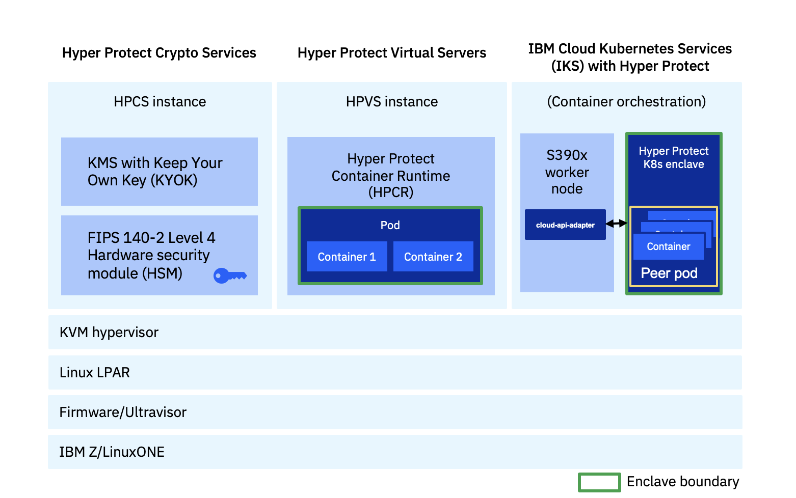

---

copyright:
  years: 2023, 2023
lastupdated: "2023-08-07"

keywords: 

subcollection: confidential-computing

---

{{site.data.keyword.attribute-definition-list}}

# Products in Hyper Protect Platform
{: #hyper-protect-addon}

Understand the product portfolio in the Hyper Protect platform.

{: caption="Figure 1. Hyper Protect products" caption-side="bottom"}

## Hyper Protect Container Runtime
{: #hpcr}

{: caption="Figure 2. Hyper Protect Container Runtime on public and Hybrid cloud" caption-side="bottom"}

You can deploy a workload built with SUSE Linux Enterprise Base Container Images into the Hyper Protect Container Runtime in a hybrid confidential computing environment. For more information, see [Confidential Computing with SUSE Linux Enterprise Base Container Images Using the IBM Hyper Protect Platform](https://documentation.suse.com/trd/linux/single-html/gs_sles_ibm-hpvs).

## Hyper Protect Virtual Servers
{: #hpvs}

TO-do:  need the product architecure diagram and explanation

## Hyper Protect Crytpo Services
{: #hpcs}

TO-do:  need the product architecure diagram and explanation

## Hyper Protect managed Add-on for Kubernetes
{: #ikswhp}

TO-do:  need the product architecure diagram and explanation