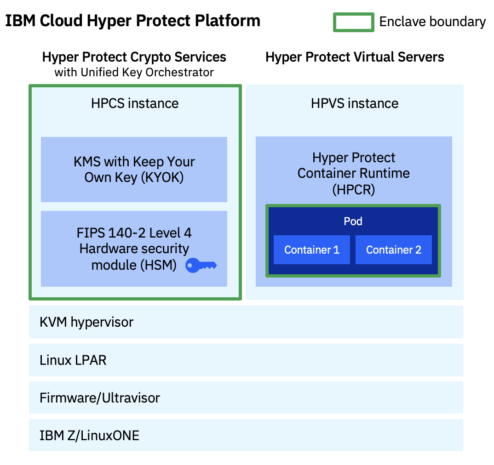

---

copyright:
  years: 2023, 2023
lastupdated: "2023-11-24"

keywords: hyper protect services, hpvs, hpcs

subcollection: confidential-computing

---

{{site.data.keyword.attribute-definition-list}}

# Products in Hyper Protect Platform
{: #hyper-protect-products}

The Hyper Protect Platform is comprised of the following products:

- [IBM Cloud Hyper Protect Virtual Servers for VPC](#hpvs-cloud)
- [IBM Hyper Protect Virtual Servers for on-premises environments](#hpvs-on-prem)
- [{{site.data.keyword.hscrypto}}](#hpcs)

The following figure illustrates the products portfolio and the enclave boundary for each product:

{: caption="Figure 1. Hyper Protect products" caption-side="bottom"}

## Hyper Protect Virtual Servers for VPC
{: #hpvs-cloud}

Hyper Protect Virtual Servers for VPC leverage the IBM Secure Execution for Linux technology to provide the latest confidential computing as-a-service solution on IBM Cloud. It is a fully managed confidential computing container runtime that enables you to deploy containerized workloads in isolated tamper-proof computing environments, thus mitigating your security concerns about moving mission-critical workloads to public clouds. For more information, see [Confidential computing with LinuxONE](/docs/vpc?topic=vpc-about-se){: external}.

You can now also deploy a workload built with SUSE Linux Enterprise Base Container Images into the Hyper Protect Container Runtime in a hybrid confidential computing environment. For more information, see [Confidential Computing with SUSE Linux Enterprise Base Container Images Using the IBM Hyper Protect Platform](https://documentation.suse.com/trd/linux/single-html/gs_sles_ibm-hpvs){: external}.

## Hyper Protect Virtual Servers
{: #hpvs-on-prem}

IBM Hyper Protect Virtual Servers leverage the IBM Secure Execution for Linux technology to protect Linux workloads on IBM Z and LinuxONE throughout the application lifecycle – from build through to deploy and manage. You can be confident that applications and data are always private and protected from internal and external threats. For more information, see [IBM Hyper Protect Virtual Services documentation](https://www.ibm.com/docs/en/hpvs/2.1.x){: external}.

## {{site.data.keyword.hscrypto}}
{: #hpcs}

{{site.data.keyword.cloud_notm}} {{site.data.keyword.hscrypto}} is a dedicated key management service and Hardware Security Module (HSM) that provides you with the Keep Your Own Key (KYOK) capability for cloud data encryption. Built on FIPS 140-2 Level 4 certified hardware, {{site.data.keyword.hscrypto}} provides you with exclusive control of your encryption keys. You can take the ownership of the HSM through master key initialization. With {{site.data.keyword.uko_full_notm}}, you can connect your service instance to keystores in IBM Cloud and third-party cloud providers, back up and manage keys using a unified system, and orchestrate keys across multiple clouds.

The following architecture diagram shows how you interact with Hyper Protect Crypto Services components to protect your sensitive data and keys.

{: caption="Figure 1. Interaction with {{site.data.keyword.hscrypto}} components" caption-side="bottom"}

{{site.data.keyword.uko_full_notm}} mainly provides the following features:

| Feature name |  Description |  Usage and reference link |
|----|-----|------|
| Key Management Service (KMS) |  Generate and manage encryption keys.   | - [Monitoring the lifecycle of encryption keys](/docs/hs-crypto?topic=hs-crypto-uko-key-states){: external} \n - [Key management service API reference](/apidocs/hs-crypto){: external}   |
| Universal Key Orchestration (UKO)  |   Manage internal and external keys across multiple clouds from a single pane of glass.  |  - [UKO introduction](/docs/hs-crypto?topic=hs-crypto-uko-overview){: external} \n - [UKO tutorial](/docs/hs-crypto?topic=hs-crypto-tutorial-uko-satellite){: external} \n - [UKO API reference](/apidocs/uko){: external} |
| Hardware Security Module (HSM) | Perform cryptographic operations with FIPS 140-2 level 4 certified HSMs on cloud. | - [PKCS #11 API reference](/docs/hs-crypto?topic=hs-crypto-pkcs11-api-ref){: external} \n - [GREP 11 API reference](/docs/hs-crypto?topic=hs-crypto-grep11-api-ref){: external}   |
{: caption="Table 1. Major features in Hyper Protect Crypto Service" caption-side="bottom"}
