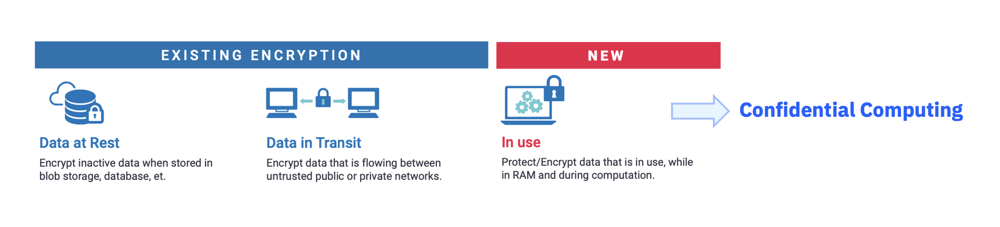

---

copyright:
  years: 2023, 2023
lastupdated: "2023-08-03"

keywords: 

subcollection: confidential-computing

---

{{site.data.keyword.attribute-definition-list}}

# Deploying transactional workloads with confidential computing capability
{: #deploy-workload}

Use `docker-compose.yml` file and deploy the app into the HPVS instance , or deploy multiple containers as a pod into the HPVS instance.

{: caption="Figure 1. Confidential Computing" caption-side="bottom"}

